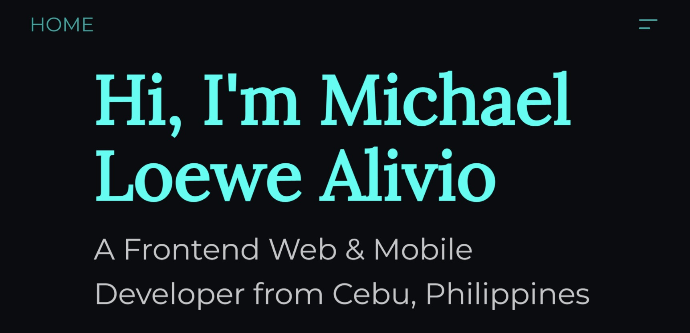

<!-- AUTO-GENERATED-CONTENT:START (STARTER) -->

  

# 👋 Hello.

This is a repository for my personal portfolio. There's nothing much to say apart from the code itself. In the future, I'm planning to continuously build the site to polish my skills in React and in HTML/CSS. Really excited to see where I could go with CSS animation!

## 🧐 What's inside?

A quick look inside the src directory where the fun stuff begins.

    .
    ├── components
    ├── hooks
    ├── images
    ├── pages
    ├── styled-components
    ├── styles
    ├── theme

Much of the stuff in the project directory is from gatsby's CLI initialization.

1.  **`/components`**: This directory usually contains common components that are found throughout the website/UI.

2.  **`/hooks`**: A global-like hooks directory where custom react-hooks are contained.

3.  **`/images`**: This directory contains asset images to be used throughout the site.

4.  **`/pages`**: This directory contains the bulk of the logic. This also takes advantage of gatsby's routing filesystem.

5.  **`/styled-components`**: This contains files that are used as styled-components throughout the app/site.

6.  **`/styles`**: A directory for CSS stylesheets.

## 🔨 TODO

Possible features that are to be implemented in the future.

1. Page templates for each file in pages directory
1. Templates for each file directory in _projects/_

<!-- AUTO-GENERATED-CONTENT:END -->
